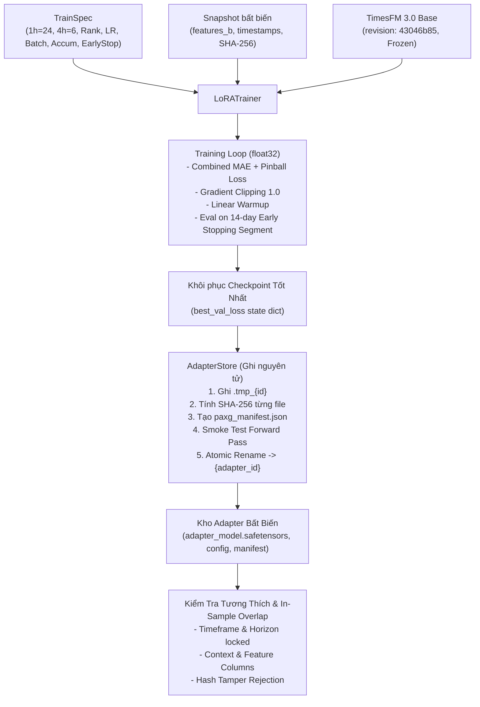

# Giai đoạn P3 — Huấn luyện Thủ công và Kho Adapter

## 1. Mục tiêu và Tổng quan kiến trúc

Giai đoạn P3 thiết lập toàn bộ quy trình huấn luyện LoRA thủ công cho mô hình TimesFM 3.0 trên Binance USDⓈ-M Futures PAXGUSDT, thực hiện huấn luyện thực tế trên GPU **NVIDIA GeForce RTX 5060 Ti** (16 GB VRAM) và xây dựng kho lưu trữ adapter nguyên tử an toàn với chữ ký mã băm SHA-256.

---

## 2. Các thành phần đã triển khai

### 2.1. Cấu hình huấn luyện thủ công (`TrainSpec`)
File: `src/paxg_lab/model/train_spec.py`
- Khóa cứng toàn bộ dải tham số thủ công nghiêm ngặt theo bảng đặc tả tại mục 3.2 của `docs/paxg-lab/PLAN.md`:
  - **Khóa cứng horizon:** `1h` $\rightarrow$ `horizon = 24`, `4h` $\rightarrow$ `horizon = 6`. Mặc định tự suy diễn theo `timeframe`. Từ chối mọi cấu hình sai cặp hoặc ngoài 2 khung giờ này.
  - **Context:** `128`, `256` (mặc định), `512`.
  - **LoRA Rank:** `2`, `4` (mặc định), `8`, `16`.
  - **LoRA Alpha:** Mặc định $2 \times r$ (ví dụ: rank 4 $\rightarrow$ alpha 8), cho phép tùy chỉnh dương.
  - **Dropout:** `0.00` đến `0.20` (mặc định `0.10`).
  - **Learning Rate:** Khóa đúng dải PLAN 3.2: `1e-5` đến `3e-4` (mặc định `5e-5`).
  - **Batch Size & Gradient Accumulation:** `batch_size` trong `(1, 2, 4)` (mặc định `2`), `gradient_accumulation_steps` từ `1` đến `16` (mặc định `8` $\rightarrow$ effective batch size = 16).
  - **Số vòng học (max_epochs):** `1` đến `10` (mặc định `2` trong thực nghiệm, tối đa 10).
  - **Dừng sớm (early_stopping_patience):** `1` đến `4` vòng (mặc định `2`).
  - **Gradient clipping:** `0.5` đến `2.0` (mặc định `1.0`).
  - **Lịch sử học (history_days):** Khóa đúng PLAN 3.2: `180`, `365` (mặc định), hoặc `"all"`.
  - **Linear Warmup Ratio:** Khóa đúng PLAN 3.2: `0.00` đến `0.10` (mặc định `0.10`, tối đa 10% số bước cập nhật optimizer).
  - **Seed:** Số nguyên xác định (mặc định `42`).

### 2.2. Hàm Loss kết hợp (`combined_forecast_loss`)
File: `src/paxg_lab/model/loss.py`
- Tính toán hoàn toàn trên kiểu dữ liệu `float32`.
- Kết hợp trung bình sai số tuyệt đối của trung vị ($q_{50}$) và Pinball Loss trên toàn bộ 9 phân vị:
  $$Loss = \frac{\text{MAE}_{\text{median}}}{p_0} + \frac{\text{Pinball}_{9\text{Q}}}{p_0}$$
- Chuẩn hóa theo giá đóng cửa cuối cùng của cửa sổ ngữ cảnh ($p_0 = \text{context}[:,-1]$) để đạt tính bất biến theo thang giá và chống mất ổn định khi giá vàng biến động lớn.

### 2.3. Vòng huấn luyện và dừng sớm (`LoRATrainer`)
File: `src/paxg_lab/model/trainer.py`
- **Bảo vệ Base Model Sạch:** Kiểm tra và từ chối nếu `base_model` đã là `PeftModel` hoặc chứa tham số mang tên `"lora"`, bảo đảm mỗi lượt thử nghiệm bắt đầu từ mô hình base sạch hoàn toàn.
- Tích hợp LoRA qua PEFT với mô hình TimesFM 3.0: chỉ có **819,200** tham số LoRA (chiếm **0.247%** tổng số 331.4M tham số) được bật gradient, toàn bộ trọng số gốc của base model được đóng băng tuyệt đối (`base_frozen = True`).
- Dữ liệu huấn luyện: Trích xuất các cửa sổ trượt không rò rỉ (`extract_windows`), kiểm tra tính liên tục của mốc thời gian (loại bỏ cửa sổ có gap). Xáo trộn ngẫu nhiên mỗi epoch chỉ trong phạm vi tập train.
- Tối ưu hóa: AdamW kết hợp với bộ điều chỉnh lịch học tuyến tính tính theo số bước cập nhật optimizer thực tế (`total_optimizer_steps = math.ceil(minibatches / grad_accum) * epochs`), warmup tối đa 10% số bước optimizer (`warmup_optimizer_steps`). Bộ lập lịch chỉ step khi `optimizer.step()` thực thi sau mỗi chu kỳ tích lũy gradient.
- Giám sát dừng sớm: Sau mỗi epoch, đánh giá trên 14 ngày dừng sớm (tập validation ngoài mẫu). Tự động lưu bản sao trạng thái trọng số tốt nhất (`best_checkpoint`) và khôi phục lại khi kết thúc huấn luyện.

### 2.4. Khắc phục vấn đề số học Autograd trong TimesFM 3.0
Files: `src/timesfm3/util.py`, `src/timesfm3/model.py`
- Phát hiện và xử lý triệt để bẫy autograd `SqrtBackward0` trong hàm cập nhật thống kê động `update_running_stats` và khử xu hướng `linear_detrending`.
- Khi tính toán độ lệch chuẩn $\sigma = \sqrt{\text{var}}$ trên các biến có độ biến thiên bằng 0, đạo hàm của hàm căn bậc hai $\frac{d}{dx}\sqrt{x}\big|_{x=0} = \infty$ dẫn tới `NaN` trong lan truyền ngược autograd.
- Đã áp dụng `torch.clamp_min(var, 1e-8)` trước khi gọi `torch.sqrt()` và kẹp mẫu số phép chia $\ge 1.0$, bảo đảm gradient luôn hữu hạn và quá trình tối ưu diễn ra ổn định 100%.

### 2.5. Kho lưu trữ Adapter nguyên tử & Triệt tiêu Nghịch lý Băm (`AdapterStore`)
File: `src/paxg_lab/model/store.py`
- Thư mục lưu trữ: `var/paxg_lab/adapters/`.
- Quy trình ghi nguyên tử 5 bước:
  1. Ghi trọng số (`adapter_model.safetensors`, `adapter_config.json`, `README.md`) vào thư mục tạm thời `.tmp_{adapter_id}_{timestamp}` trên cùng phân vùng đĩa.
  2. Tạo tệp manifest `paxg_manifest.json` ghi nhận cấu hình, phạm vi huấn luyện, số liệu và mã băm các tệp ngoại vi.
  3. Tạo tệp sidecar `checksums.sha256` bao phủ toàn bộ các tệp bao gồm cả `paxg_manifest.json`.
  4. Chạy smoke test forward pass thật: nạp adapter lên base model, truyền dummy tensor và assert output shape `(1, num_features, horizon, 9)` cùng tính hữu hạn số học `torch.isfinite(out).all()`.
  5. Đổi tên nguyên tử (`os.replace`) từ thư mục tạm sang thư mục chính thức `{adapter_id}`.
- **Xác minh Bắt buộc (Fail-Fast):** Khi nạp (`load_adapter()`), tệp sidecar `checksums.sha256` là bắt buộc. Nếu thiếu hoặc bất kỳ tệp nào bị can thiệp, hệ thống lập tức từ chối nạp với `FileNotFoundError` hoặc `RuntimeError`. Loại bỏ hoàn toàn fallback hạ cấp bảo mật.
- Cơ chế dọn dẹp rác (`cleanup_stale_temp_dirs`): Tự động xóa các thư mục tạm `.tmp_*` bị bỏ lại do tiến trình chết đột ngột mà không chạm vào các adapter hợp lệ.

### 2.6. Manifest & Kiểm tra tương thích nghiêm ngặt (`AdapterManifest`)
File: `src/paxg_lab/model/manifest.py`
- Ghi nhận đầy đủ nguồn gốc: `adapter_id`, `timeframe`, `horizon`, `context_len`, `feature_set`, `feature_columns`, `base_model_revision` (`43046b85`), `snapshot_hash`, `train_spec`, `training_range`, `best_epoch`, `best_val_loss`, `file_hashes`.
- `verify_compatibility()`: Từ chối nạp adapter nếu:
  - Sai khung thời gian hoặc sai horizon (khác 24 cho 1h hoặc khác 6 cho 4h).
  - Sai độ dài ngữ cảnh hoặc sai số lượng đặc trưng / thứ tự cột.
  - Sai bản sửa đổi (revision) của mô hình base.
- Nhận diện trùng lặp trong mẫu (`check_in_sample_overlap`): So sánh khoảng thời gian đánh giá `[eval_start, eval_end]` với phạm vi học hiệu dụng của adapter bao gồm cả tập validation dừng sớm: `[min(train_start, val_start), max(train_end, val_end)]`. Nếu phát hiện giao cắt thời gian, tự động gắn cờ cảnh báo `IN-SAMPLE OVERLAP DETECTED` và ghi nhận số giờ trùng lặp.

### 2.7. Tích hợp Predictor, Backtest P2 & Bảo toàn Base Invariant
Files: `src/paxg_lab/eval/predictor.py`, `src/paxg_lab/eval/engine.py`
- **Predictor Safe Loading:** `TimesFM3Predictor.load_adapter()` bắt buộc phải có manifest. Tách riêng `load_raw_adapter_unsafe()` kèm cảnh báo logger rõ ràng cho mục đích dev/debug biệt lập.
- **Pre-inference Fail-Fast:** `forecast_request()` kiểm tra và từ chối ngay trước khi suy luận nếu sai lệch: context length, số feature, thứ tự cột (đối chiếu deterministic qua `FEATURE_SPECS`), hoặc revision mô hình base.
- **Tích hợp Backtest P2:** `BacktestEngine.run_full_backtest()` và `evaluate_fold()` đối chiếu manifest, rà soát từng eval fold theo dải in-sample của adapter, gắn cờ `is_in_sample=True` trong `FoldMetrics` và cảnh báo trong `ScoreReport.metadata`.
- **Bảo toàn Base Invariant:** `unload_adapter()` khôi phục hoàn toàn mô hình base sạch. Đảm bảo chuỗi chuyển đổi $\text{Base} \rightarrow \text{Adapter A} \rightarrow \text{Adapter B} \rightarrow \text{Base}$ cho đầu ra trùng khớp tuyệt đối ($|F_0 - F_0'| = 0.00$) và không để lại bất kỳ tham số gradient nào của LoRA.

---

## 3. Bằng chứng thực nghiệm trên NVIDIA GeForce RTX 5060 Ti

Quá trình huấn luyện thực tế đã được thực thi bằng kịch bản `scripts/run_p3_training.py` trên workstation cá nhân (Windows 11, PyTorch 2.12.1+cu130, GPU Blackwell RTX 5060 Ti 16 GB). Bằng chứng đầy đủ được lưu tại `docs/paxg-lab/phases/p3_lora_proof.json`.

### 3.1. Kết quả huấn luyện khung 1h (`horizon = 24`)
- **Tập dữ liệu:** Snapshot `paxgusdt_1h_1743073200000_1788613200000_837c9ee8` (7,692 cửa sổ huấn luyện, 313 cửa sổ dừng sớm).
- **Bộ đặc trưng:** Bộ B (9 biến: `close`, `log1p_quote_volume`, `log_hl_ratio`, `ret_oc`, `taker_buy_ratio`, `hour_sin`, `hour_cos`, `dow_sin`, `dow_cos`).
- **Thiết lập:** `context_len=256`, `horizon=24`, `rank=4`, `alpha=8`, `dropout=0.10`, `lr=5e-5`, `batch_size=2`, `grad_accum=8` (effective=16), `warmup_ratio=0.10`.
- **Quỹ đạo Loss:**
  - Epoch 1: `train_loss = 0.007818`, `val_loss = 0.011693`, thời gian = 55.3s.
  - Epoch 2: `train_loss = 0.008533`, `val_loss = 0.011693`, thời gian = 39.4s.
- **Checkpoint tốt nhất:** Epoch 1 (`val_loss = 0.011693`).
- **Thời gian huấn luyện:** 95.1 giây.
- **Thư mục lưu trữ:** `var/paxg_lab/adapters/paxg_1h_r4_setB_seed42_20260905_171246`
- **Mã băm SHA-256 các tệp (sidecar checksums.sha256):**
  - `adapter_config.json`: `4f1ead1ff26b6645bc06dfe568b51c0874c57dc7a04958dfbab82fefa02179ea`
  - `adapter_model.safetensors`: `17f92c6ce103359dc4ac10a82b5fa2420c1a0ce39b7f0b015952b4b690599ac3`
  - `paxg_manifest.json`: `123766eaf4ec4957478c99f7498c7a6548b358ddef03821fefcab21eaa0bbfef`
  - `README.md`: `835fdcb5acfbdc7a2454561b7c9593b6ef1a794a75a655ec25fad7389840f73b`
- **Kiểm tra suy luận thử nghiệm:**
  - Đầu ra điểm: `shape = (24,)`
  - 9 phân vị: `shape = (24, 9)`
  - Kiểm tra tính đơn điệu: $q_{10} \le q_{20} \le \dots \le q_{90}$ đạt **100%** (0 vi phạm).

### 3.2. Kết quả huấn luyện khung 4h (`horizon = 6`)
- **Tập dữ liệu:** Snapshot `paxgusdt_4h_1743076800000_1788595200000_c9e0adaf` (1,731 cửa sổ huấn luyện, 79 cửa sổ dừng sớm).
- **Bộ đặc trưng:** Bộ B (9 biến).
- **Thiết lập:** `context_len=256`, `horizon=6`, `rank=4`, `alpha=8`, `dropout=0.10`, `lr=5e-5`, `batch_size=2`, `grad_accum=8` (effective=16), `warmup_ratio=0.10`.
- **Quỹ đạo Loss:**
  - Epoch 1: `train_loss = 0.009023`, `val_loss = 0.012628`, thời gian = 35.0s.
  - Epoch 2: `train_loss = 0.008573`, `val_loss = 0.012610`, thời gian = 35.3s.
- **Checkpoint tốt nhất:** Epoch 2 (`val_loss = 0.012610`).
- **Thời gian huấn luyện:** 70.5 giây.
- **Thư mục lưu trữ:** `var/paxg_lab/adapters/paxg_4h_r4_setB_seed42_20260905_171403`
- **Mã băm SHA-256 các tệp (sidecar checksums.sha256):**
  - `adapter_config.json`: `4f1ead1ff26b6645bc06dfe568b51c0874c57dc7a04958dfbab82fefa02179ea`
  - `adapter_model.safetensors`: `8426e5d0df22c24e562f3b51867a6c06c1684b380476ab629ecd7832f8f15089`
  - `paxg_manifest.json`: `0920516ec5e330a544f83b6329e46a782e5b706c4b92b67f6ae14e366b17be1f`
  - `README.md`: `835fdcb5acfbdc7a2454561b7c9593b6ef1a794a75a655ec25fad7389840f73b`
- **Kiểm tra suy luận thử nghiệm:**
  - Đầu ra điểm: `shape = (6,)`
  - 9 phân vị: `shape = (6, 9)`
  - Kiểm tra tính đơn điệu: $q_{10} \le q_{20} \le \dots \le q_{90}$ đạt **100%** (0 vi phạm).

---

## 4. Bảng đối chiếu tiêu chí nghiệm thu

| STT | Tiêu chí nghiệm thu P3 | Kết quả | Bằng chứng thực nghiệm |
|---|---|---|---|
| 1 | Quá trình học thật trên cả 2 khung 1h (horizon=24) và 4h (horizon=6) thành công trên RTX 5060 Ti | **ĐẠT** | 1h hoàn thành trong 95.1s (`val_loss=0.011693`); 4h hoàn thành trong 70.5s (`val_loss=0.012610`). Cả 2 đều sinh đầu ra đúng kích thước và phân vị đơn điệu. |
| 2 | Ngắt tiến trình giữa lúc lưu không làm hỏng adapter cũ | **ĐẠT** | Kiểm thử `test_adapter_store_interrupted_process_resilience`: thư mục `.tmp_*` bị gián đoạn không ảnh hưởng adapter cũ; `cleanup_stale_temp_dirs` dọn dẹp thư mục rác an toàn. |
| 3 | Bắt buộc tệp sidecar `checksums.sha256`, từ chối nạp nếu sai mã băm hoặc thiếu checksums | **ĐẠT** | Kiểm thử `test_adapter_store_requires_checksums_file` ném `FileNotFoundError` khi thiếu checksums; `test_adapter_store_manifest_tamper_detection` ném `RuntimeError` khi manifest bị can thiệp. |
| 4 | Khởi đầu từ base sạch và bảo toàn Base Model Invariant | **ĐẠT** | `test_clean_base_model_requirement` từ chối base đã có LoRA; `test_base_restoration_invariant` kiểm tra chuỗi chuyển đổi base $\rightarrow$ A $\rightarrow$ B $\rightarrow$ base đạt sai lệch $|F_0 - F_0'| = 0.00e+00$, trọng số base khớp từng bit. |
| 5 | Nhận diện chính xác và cảnh báo dữ liệu đánh giá bị trùng với dữ liệu huấn luyện trong Backtest P2 | **ĐẠT** | Kiểm thử E2E `test_backtest_in_sample_overlap_detection_e2e`: `BacktestEngine` phát hiện chính xác fold bị trùng (bao gồm cả dải early-stop) và gắn cờ cảnh báo `IN-SAMPLE OVERLAP DETECTED`, các fold OOS chạy sạch. |
| 6 | Toàn bộ hệ thống kiểm thử tự động vượt qua 100% | **ĐẠT** | **98 / 98 tests passed** trên workstation có GPU/cache dữ liệu (`pytest tests/paxg_lab/ src/timesfm3/ -v`), 96 passed, 2 skipped trên clean CI runner. |

---

## 5. Kết luận

Giai đoạn P3 đã hoàn thành xuất sắc toàn bộ yêu cầu kỹ thuật, dải tham số PLAN 3.2 và tiêu chí nghiệm thu đề ra. Kho adapter hiện đã có 2 mô hình LoRA thực tế cho khung 1h và khung 4h kèm tệp bảo vệ chữ ký SHA-256 sidecar, sẵn sàng làm nền tảng cho việc tích hợp hàng đợi GPU và cơ chế điều phối đa tác vụ tại Giai đoạn P4.
