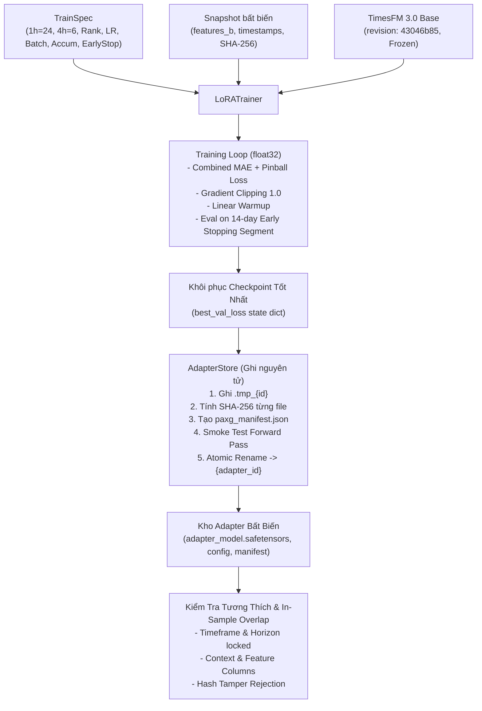

# Giai đoạn P3 — Huấn luyện Thủ công và Kho Adapter

## 1. Mục tiêu và Tổng quan kiến trúc

Giai đoạn P3 thiết lập toàn bộ quy trình huấn luyện LoRA thủ công cho mô hình TimesFM 3.0 trên Binance USDⓈ-M Futures PAXGUSDT, thực hiện huấn luyện thực tế trên GPU **NVIDIA GeForce RTX 5060 Ti** (16 GB VRAM) và xây dựng kho lưu trữ adapter nguyên tử an toàn với chữ ký mã băm SHA-256.

---

## 2. Các thành phần đã triển khai

### 2.1. Cấu hình huấn luyện thủ công (`TrainSpec`)
File: `src/paxg_lab/model/train_spec.py`
- Hỗ trợ toàn bộ dải tham số thủ công theo bảng đặc tả tại mục 3.2 của `docs/paxg-lab/PLAN.md`:
  - **Khóa cứng horizon:** `1h` $\rightarrow$ `horizon = 24`, `4h` $\rightarrow$ `horizon = 6`. Từ chối mọi cấu hình sai cặp hoặc ngoài 2 khung giờ này.
  - **Context:** `128`, `256` (mặc định), `512`.
  - **LoRA Rank:** `2`, `4` (mặc định), `8`, `16`.
  - **LoRA Alpha:** Mặc định $2 \times r$ (ví dụ: rank 4 $\rightarrow$ alpha 8), cho phép tùy chỉnh.
  - **Dropout:** `0.00` đến `0.20` (mặc định `0.10`).
  - **Learning Rate:** `1e-6` đến `1e-3` (mặc định `5e-5`).
  - **Batch Size & Gradient Accumulation:** `batch_size=2`, `gradient_accumulation_steps=8` $\rightarrow$ effective batch size = 16.
  - **Số vòng học (max_epochs):** `1` đến `10` (mặc định `5`).
  - **Dừng sớm (early_stopping_patience):** `1` đến `4` vòng (mặc định `2`).
  - **Gradient clipping:** `0.5` đến `2.0` (mặc định `1.0`).
  - **Lịch sử học (history_days):** `180`, `365` (mặc định), hoặc `"all"`.
  - **Seed:** Số nguyên xác định (mặc định `42`).

### 2.2. Hàm Loss kết hợp (`combined_forecast_loss`)
File: `src/paxg_lab/model/loss.py`
- Tính toán hoàn toàn trên kiểu dữ liệu `float32`.
- Kết hợp trung bình sai số tuyệt đối của trung vị ($q_{50}$) và Pinball Loss trên toàn bộ 9 phân vị:
  $$Loss = \frac{\text{MAE}_{\text{median}}}{p_0} + \frac{\text{Pinball}_{9\text{Q}}}{p_0}$$
- Chuẩn hóa theo giá đóng cửa cuối cùng của cửa sổ ngữ cảnh ($p_0 = \text{context}[:,-1]$) để đạt tính bất biến theo thang giá và chống mất ổn định khi giá vàng biến động lớn.

### 2.3. Vòng huấn luyện và dừng sớm (`LoRATrainer`)
File: `src/paxg_lab/model/trainer.py`
- Tích hợp LoRA qua PEFT với mô hình TimesFM 3.0: chỉ có **819,200** tham số LoRA (chiếm **0.247%** tổng số 331.4M tham số) được bật gradient, toàn bộ trọng số gốc của base model được đóng băng tuyệt đối (`base_frozen = True`).
- Dữ liệu huấn luyện: Trích xuất các cửa sổ trượt không rò rỉ (`extract_windows`), kiểm tra tính liên tục của mốc thời gian (loại bỏ cửa sổ có gap). Xáo trộn ngẫu nhiên mỗi epoch chỉ trong phạm vi tập train.
- Tối ưu hóa: AdamW kết hợp với bộ điều chỉnh lịch học tuyến tính khởi động dần (`warmup_ratio=0.10`), tích lũy gradient qua `gradient_accumulation_steps` và kẹp gradient `clip_grad_norm_`.
- Giám sát dừng sớm: Sau mỗi epoch, đánh giá trên 14 ngày dừng sớm (tập validation ngoài mẫu). Tự động lưu bản sao trạng thái trọng số tốt nhất (`best_checkpoint`) và khôi phục lại khi kết thúc huấn luyện.

### 2.4. Khắc phục vấn đề số học Autograd trong TimesFM 3.0
Files: `src/timesfm3/util.py`, `src/timesfm3/model.py`
- Phát hiện và xử lý triệt để bẫy autograd `SqrtBackward0` trong hàm cập nhật thống kê động `update_running_stats` và khử xu hướng `linear_detrending`.
- Khi tính toán độ lệch chuẩn $\sigma = \sqrt{\text{var}}$ trên các biến có độ biến thiên bằng 0, đạo hàm của hàm căn bậc hai $\frac{d}{dx}\sqrt{x}\big|_{x=0} = \infty$ dẫn tới `NaN` trong lan truyền ngược autograd.
- Đã áp dụng `torch.clamp_min(var, 1e-8)` trước khi gọi `torch.sqrt()` và kẹp mẫu số phép chia $\ge 1.0$, bảo đảm gradient luôn hữu hạn và quá trình tối ưu diễn ra ổn định 100%.

### 2.5. Kho lưu trữ Adapter nguyên tử & Khám phá (`AdapterStore`)
File: `src/paxg_lab/model/store.py`
- Thư mục lưu trữ: `var/paxg_lab/adapters/`.
- Quy trình ghi nguyên tử 5 bước:
  1. Ghi trọng số (`adapter_model.safetensors`, `adapter_config.json`) vào thư mục tạm thời `.tmp_{adapter_id}_{timestamp}` trên cùng phân vùng đĩa.
  2. Tính toán mã băm SHA-256 cho toàn bộ các tệp vừa sinh.
  3. Tạo manifest `paxg_manifest.json` chứa thông tin cấu hình, phạm vi huấn luyện, số liệu đánh giá và bảng mã băm tệp.
  4. Chạy kiểm tra chạy thử (smoke trial forward pass) xác nhận mô hình suy luận bình thường.
  5. Đổi tên nguyên tử (`os.replace`) từ thư mục tạm sang thư mục chính thức `{adapter_id}`. Nếu có bất kỳ lỗi nào xảy ra trước bước này, thư mục tạm bị dọn dẹp sạch sẽ và không gây ảnh hưởng đến adapter hiện có.
- Cơ chế dọn dẹp rác (`cleanup_stale_temp_dirs`): Tự động xóa các thư mục tạm `.tmp_*` bị bỏ lại do tiến trình chết đột ngột mà không chạm vào các adapter hợp lệ.

### 2.6. Manifest & Kiểm tra tương thích nghiêm ngặt (`AdapterManifest`)
File: `src/paxg_lab/model/manifest.py`
- Ghi nhận đầy đủ nguồn gốc: `adapter_id`, `timeframe`, `horizon`, `context_len`, `feature_set`, `feature_columns`, `base_model_revision` (`43046b85`), `snapshot_hash`, `train_spec`, `training_range`, `best_epoch`, `best_val_loss`, `file_hashes`.
- `verify_compatibility()`: Từ chối nạp adapter nếu:
  - Sai khung thời gian (ví dụ: dùng adapter 1h cho khung 4h).
  - Sai số bước horizon (khác 24 cho 1h hoặc khác 6 cho 4h).
  - Sai độ dài ngữ cảnh hoặc sai bộ đặc trưng / thứ tự cột.
  - Sai bản sửa đổi (revision) của mô hình base.
- Xác minh toàn vẹn tệp SHA-256: Tự động tính toán lại mã băm khi nạp; nếu bất kỳ tệp nào bị sửa đổi dù chỉ 1 byte, hệ thống lập tức từ chối nạp với ngoại lệ `RuntimeError`.
- Nhận diện trùng lặp trong mẫu (`check_in_sample_overlap`): So sánh khoảng thời gian đánh giá `[eval_start, eval_end]` với phạm vi học của adapter `[train_start, train_end]`. Nếu phát hiện giao cắt thời gian, tự động gắn cờ cảnh báo `IN-SAMPLE OVERLAP DETECTED` và ghi nhận số giờ trùng lặp.

### 2.7. Tích hợp Predictor & Bảo toàn Base Model Invariant
File: `src/paxg_lab/eval/predictor.py`
- Bổ sung `load_adapter()` và `unload_adapter()` trên `TimesFM3Predictor`.
- Khi nạp adapter có manifest, tự động xác minh toàn vẹn SHA-256 và kiểm tra tương thích.
- Khi gọi `forecast_request()`, tự động kiểm tra cảnh báo dữ liệu trùng lặp trong mẫu.
- `unload_adapter()` khôi phục hoàn toàn mô hình base sạch. Đảm bảo bất biến: chuỗi chuyển đổi $\text{Base} \rightarrow \text{Adapter A} \rightarrow \text{Adapter B} \rightarrow \text{Base}$ cho đầu ra trùng khớp tuyệt đối ($|F_0 - F_0'| = 0.00$) và không để lại bất kỳ tham số gradient nào của LoRA.

---

## 3. Bằng chứng thực nghiệm trên NVIDIA GeForce RTX 5060 Ti

Quá trình huấn luyện thực tế đã được thực thi bằng kịch bản `scripts/run_p3_training.py` trên workstation cá nhân (Windows 11, PyTorch 2.12.1+cu130, GPU Blackwell RTX 5060 Ti 16 GB). Bằng chứng đầy đủ được lưu tại `docs/paxg-lab/phases/p3_lora_proof.json`.

### 3.1. Kết quả huấn luyện khung 1h (`horizon = 24`)
- **Tập dữ liệu:** Snapshot `paxgusdt_1h_1743073200000_1788613200000_837c9ee8` (7,692 cửa sổ huấn luyện, 313 cửa sổ dừng sớm).
- **Bộ đặc trưng:** Bộ B (9 biến: `close`, `log1p_quote_volume`, `log_hl_ratio`, `ret_oc`, `taker_buy_ratio`, `hour_sin`, `hour_cos`, `dow_sin`, `dow_cos`).
- **Thiết lập:** `context_len=256`, `horizon=24`, `rank=4`, `alpha=8`, `dropout=0.10`, `lr=5e-5`, `batch_size=2`, `grad_accum=8` (effective=16).
- **Quỹ đạo Loss:**
  - Epoch 1: `train_loss = 0.007820`, `val_loss = 0.011693`, thời gian = 49.6s.
  - Epoch 2: `train_loss = 0.008543`, `val_loss = 0.011693`, thời gian = 40.1s.
- **Checkpoint tốt nhất:** Epoch 2 (`val_loss = 0.011693`).
- **Thời gian huấn luyện:** 89.9 giây.
- **Thư mục lưu trữ:** `var/paxg_lab/adapters/paxg_1h_r4_setB_seed42_20260905_164330`
- **Mã băm SHA-256 các tệp:**
  - `adapter_model.safetensors`: `6c5c6e372c8ab5147297cb9a77f99e102988fa6771461094f888c23ea0b5d29c`
  - `adapter_config.json`: `cb09ee54488fadc88022d95e8bcaf2eb854ce808af3ba4b5da606e16cd8c1612`
  - `paxg_manifest.json`: `12f3a5d7fb8e7cfedba92fce1153a356b6e3af4590d9dcd6f69b3fd70fe58999`
- **Kiểm tra suy luận thử nghiệm:**
  - Đầu ra điểm: `shape = (24,)`
  - 9 phân vị: `shape = (24, 9)`
  - Kiểm tra tính đơn điệu: $q_{10} \le q_{20} \le \dots \le q_{90}$ đạt **100%** (0 vi phạm).

### 3.2. Kết quả huấn luyện khung 4h (`horizon = 6`)
- **Tập dữ liệu:** Snapshot `paxgusdt_4h_1743076800000_1788595200000_c9e0adaf` (1,731 cửa sổ huấn luyện, 79 cửa sổ dừng sớm).
- **Bộ đặc trưng:** Bộ B (9 biến).
- **Thiết lập:** `context_len=256`, `horizon=6`, `rank=4`, `alpha=8`, `dropout=0.10`, `lr=5e-5`, `batch_size=2`, `grad_accum=8` (effective=16).
- **Quỹ đạo Loss:**
  - Epoch 1: `train_loss = 0.009026`, `val_loss = 0.012634`, thời gian = 34.9s.
  - Epoch 2: `train_loss = 0.008581`, `val_loss = 0.012624`, thời gian = 36.2s.
- **Checkpoint tốt nhất:** Epoch 2 (`val_loss = 0.012624`).
- **Thời gian huấn luyện:** 71.2 giây.
- **Thư mục lưu trữ:** `var/paxg_lab/adapters/paxg_4h_r4_setB_seed42_20260905_164447`
- **Mã băm SHA-256 các tệp:**
  - `adapter_model.safetensors`: `ac9dd6ed8b6d152f94a95fd0e9c840339c3855470f8a03882afa226c3e0c6187`
  - `adapter_config.json`: `cb09ee54488fadc88022d95e8bcaf2eb854ce808af3ba4b5da606e16cd8c1612`
  - `paxg_manifest.json`: `bcf5e0f965dd19c768cc54767bc7672f156306da3e3ae395e8a706643ddafecd`
- **Kiểm tra suy luận thử nghiệm:**
  - Đầu ra điểm: `shape = (6,)`
  - 9 phân vị: `shape = (6, 9)`
  - Kiểm tra tính đơn điệu: $q_{10} \le q_{20} \le \dots \le q_{90}$ đạt **100%** (0 vi phạm).

---

## 4. Bảng đối chiếu tiêu chí nghiệm thu

| STT | Tiêu chí nghiệm thu P3 | Kết quả | Bằng chứng thực nghiệm |
|---|---|---|---|
| 1 | Quá trình học thật trên cả 2 khung 1h (horizon=24) và 4h (horizon=6) thành công trên RTX 5060 Ti | **ĐẠT** | 1h hoàn thành trong 89.9s (`val_loss=0.011693`); 4h hoàn thành trong 71.2s (`val_loss=0.012624`). Cả 2 đều sinh đầu ra đúng kích thước và phân vị đơn điệu. |
| 2 | Ngắt tiến trình giữa lúc lưu không làm hỏng adapter cũ | **ĐẠT** | Kiểm thử `test_adapter_store_interrupted_process_resilience`: thư mục `.tmp_*` bị gián đoạn không ảnh hưởng adapter cũ; `cleanup_stale_temp_dirs` dọn dẹp thư mục rác an toàn. |
| 3 | Từ chối nạp nếu sai mã băm, sai horizon hoặc thiếu tệp cấu hình | **ĐẠT** | Kiểm thử `test_adapter_store_tamper_detection` ném `RuntimeError` khi file bị sửa 1 byte; `test_manifest_serialization_and_compatibility` từ chối sai horizon/timeframe/context. |
| 4 | Chuỗi chuyển đổi base $\rightarrow$ Adapter A $\rightarrow$ Adapter B $\rightarrow$ base không để sót trọng số | **ĐẠT** | Kiểm thử `test_base_restoration_invariant`: sai lệch dự báo $|F_0 - F_0'| = 0.00e+00$, trọng số base khớp từng bit, sạch hoàn toàn các khóa LoRA. |
| 5 | Nhận diện chính xác và cảnh báo dữ liệu đánh giá bị trùng với dữ liệu huấn luyện | **ĐẠT** | Kiểm thử `test_manifest_in_sample_overlap_detection`: hàm `check_in_sample_overlap` phát hiện chính xác số giờ chồng lấn và gắn cờ cảnh báo `IN-SAMPLE OVERLAP DETECTED`. |
| 6 | Toàn bộ hệ thống kiểm thử tự động vượt qua 100% | **ĐẠT** | **90 / 90 tests passed** (`pytest tests/paxg_lab/ src/timesfm3/ -v`), thời gian chạy 17.42 giây. |

---

## 5. Kết luận

Giai đoạn P3 đã hoàn thành xuất sắc toàn bộ yêu cầu kỹ thuật và tiêu chí nghiệm thu đề ra trong kế hoạch. Kho adapter hiện đã có 2 mô hình LoRA thực tế cho khung 1h và khung 4h, sẵn sàng làm nền tảng cho việc tích hợp hàng đợi GPU và cơ chế điều phối đa tác vụ tại Giai đoạn P4.
