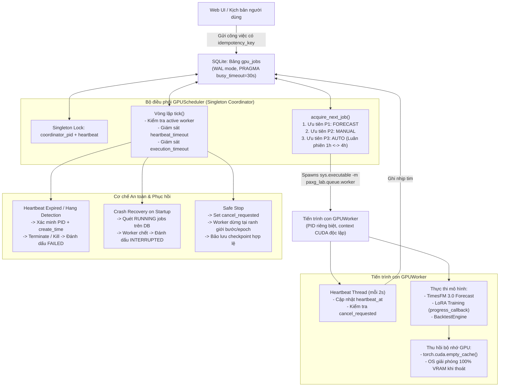

# Giai đoạn P4 — Hàng đợi GPU và Phục hồi

## 1. Mục tiêu và Kiến trúc điều phối

Giai đoạn P4 thiết lập hệ thống hàng đợi tác vụ GPU một tiến trình (Single GPU-process queue) chuyên dụng cho **PAXG Forecast Lab**, bảo đảm tài nguyên phần cứng của card đồ họa **NVIDIA GeForce RTX 5060 Ti** được sử dụng tối ưu, an toàn, không bao giờ xảy ra xung đột hay chạy đồng thời 2 tiến trình GPU, đồng thời trang bị đầy đủ cơ chế giám sát heartbeat, dừng an toàn và phục hồi sau sự cố.



---

## 2. Các thành phần đã triển khai

### 2.1. Cấu trúc dữ liệu & Máy trạng thái (`src/paxg_lab/queue/types.py`)
- **Vòng đời công việc (`JobStatus`):**
  - `QUEUED`: Đang xếp hàng chờ đến lượt.
  - `RUNNING`: Đang được tiến trình con GPU thực thi.
  - `SUCCEEDED`: Hoàn thành thành công, kết quả lưu trong `result`.
  - `FAILED`: Gặp lỗi xử lý hoặc treo nhịp tim, thông tin lưu trong `error_message`.
  - `CANCELLED`: Người dùng nhấn Dừng hoặc hủy trước/trong khi chạy.
  - `INTERRUPTED`: Tiến trình bị ngắt đột ngột (SIGKILL, app crash, reboot).
- **Phân cấp ưu tiên nghiêm ngặt (`JobPriority`):**
  - `FORECAST = 1`: Dự đoán tức thời (Độ ưu tiên cao nhất, người dùng đang đợi kết quả trên giao diện).
  - `MANUAL = 2`: Tác vụ thủ công (Huấn luyện hoặc Backtest theo yêu cầu người dùng).
  - `AUTO = 3`: Tự động tối ưu (Các vòng lặp thử nghiệm Optuna / tự động).
- **Trạng thái tự động (`AutoRunState`):**
  - `SEARCHING`, `VALIDATING`, `WAITING_DATA`, `WAITING_AUDIT`, `PAUSED_ERROR`, `STOPPED`.
- **Đặc tả công việc (`JobSpec`):**
  - Đóng gói đầy đủ: `job_id`, `job_type`, `timeframe` (`1h`, `4h`, hoặc `None`), `priority`, `status`, `payload`, `result`, `error_message`, `idempotency_key`, `worker_pid`, `worker_create_time`, `timeout_seconds` (mặc định 1200s = 20 phút), `created_at`, `started_at`, `finished_at`, `heartbeat_at`, `cancel_requested`, `progress_pct`, `progress_message`.

### 2.2. Kho lưu trữ hàng đợi SQLite (`src/paxg_lab/queue/storage.py`)
- Quản lý persistent trong SQLite database `var/paxg_lab/paxg_lab.db` với chế độ `PRAGMA journal_mode=WAL`, `PRAGMA synchronous=NORMAL`, `PRAGMA busy_timeout=30000`.
- **Chống gửi trùng lặp (Idempotency & Deduplication):**
  - Khi gửi yêu cầu qua `submit_job(spec)`, nếu có `idempotency_key` và công việc cùng khóa đang ở trạng thái `QUEUED` hoặc `RUNNING`, hàm lập tức trả về `job_id` hiện có, triệt tiêu hoàn toàn nguy cơ sinh công việc trùng lặp khi người dùng click liên tiếp hoặc tải lại trang web.
- **Trích xuất công việc nguyên tử (`acquire_next_job`):**
  - Sử dụng transaction `BEGIN IMMEDIATE`.
  - Kiểm tra điều kiện tiên quyết: Nếu đang có bất kỳ công việc nào ở trạng thái `RUNNING`, lập tức trả về `None`, bảo đảm tính bất biến **duy nhất một tiến trình GPU chạy tại một thời điểm**.
  - Truy vấn theo thứ tự ưu tiên: `FORECAST (P1)` trước $\rightarrow$ `MANUAL (P2)` tiếp theo $\rightarrow$ `AUTO (P3)` sau cùng.
- **Khóa luân phiên 1h / 4h cho công việc tự động:**
  - Khi lấy công việc `AUTO`, scheduler đối chiếu `last_auto_timeframe`. Nếu lượt trước vừa chạy `1h`, ưu tiên công việc `4h` tiếp theo; nếu lượt trước vừa chạy `4h`, ưu tiên công việc `1h`. Triệt tiêu hoàn toàn nguy cơ đói tài nguyên (starvation) của một trong hai khung thời gian.

### 2.3. Bộ điều phối GPU (`src/paxg_lab/queue/scheduler.py`)
- **Singleton Coordinator Lock:**
  - Ghi nhận `coordinator_pid`, `coordinator_create_time`, `coordinator_heartbeat` vào bảng `scheduler_state`.
  - Ngăn ngừa chạy 2 bộ điều phối cùng lúc: nếu đã có coordinator còn sống và beating trong 30s, từ chối khởi động coordinator thứ hai.
  - Tự động tiếp quản nếu coordinator cũ bị tắt đột ngột (dead PID hoặc heartbeat > 30s).
- **Vòng lặp giám sát (`tick` / `start`):**
  - Theo dõi tiến trình con đang chạy qua `poll()`.
  - Phát hiện worker chết đột ngột: nếu `poll() is not None` mà trạng thái công việc trên DB vẫn là `RUNNING`, lập tức chuyển sang `INTERRUPTED`.
  - Giám sát giới hạn thời gian (20 phút cho tác vụ tự động): nếu vượt quá `timeout_seconds`, cưỡng chế dừng an toàn và đánh dấu `INTERRUPTED`.
  - Khi không có worker nào chạy, lập tức trích xuất công việc kế tiếp có độ ưu tiên cao nhất từ SQLite.

### 2.4. Tiến trình con GPU riêng biệt (`src/paxg_lab/queue/worker.py`)
- Mỗi công việc GPU được khởi chạy độc lập thông qua `sys.executable -m paxg_lab.queue.worker --job-id <id> --db-path <path>`.
- Ghi nhận PID và `create_time` của chính mình vào SQLite ngay khi khởi động.
- Chạy luồng nền `heartbeat_thread` cập nhật `heartbeat_at` đều đặn mỗi 2 giây, đồng thời nhận phản hồi cờ `cancel_requested`.
- Tích hợp callback dừng an toàn:
  - `LoRATrainer`: hỗ trợ `progress_callback(epoch_record)`. Nếu nhận tín hiệu dừng, ngắt vòng lặp giữa các epoch, khôi phục và lưu giữ checkpoint tốt nhất đã hoàn tất (`best_lora_state`), không làm hỏng trọng số.
  - `BacktestEngine`: hỗ trợ `progress_callback` giữa các fold đánh giá.
- **Thu hồi 100% bộ nhớ GPU:** Khi công việc kết thúc, giải phóng tensor, gọi `torch.cuda.empty_cache()`, và tiến trình con thoát (`sys.exit()`). Hệ điều hành Windows tự động thu hồi toàn bộ VRAM của tiến trình đó.

### 2.5. Cơ chế Heartbeat và phát hiện tiến trình treo
- Worker định kỳ ghi nhịp tim vào trường `heartbeat_at`.
- Scheduler kiểm tra chênh lệch thời gian `now - heartbeat_at`.
- Nếu quá ngưỡng `heartbeat_timeout` (mặc định 30 giây trong vận hành, kiểm thử với 1.5s), scheduler kết luận tiến trình bị treo (hang/freeze), tiến hành thu hồi an toàn tiến trình và đánh dấu công việc là `FAILED`.

### 2.6. Bảo vệ tiến trình an toàn (`src/paxg_lab/queue/process_guard.py`)
- Tuân thủ nghiêm ngặt nguyên tắc PLAN 4.2: *Chỉ thu hồi tiến trình do ứng dụng tạo, xác minh PID và thời điểm khởi tạo.*
- `safe_terminate_process(pid, expected_create_time, timeout=5.0)`:
  - Dùng `psutil.Process(pid).create_time()` để đối chiếu với thời điểm tạo tiến trình ban đầu (dung sai 2.0s).
  - Nếu PID đã bị hệ điều hành cấp lại cho một ứng dụng khác của Windows, hệ thống **tuyệt đối từ chối dừng** và ghi cảnh báo lỗi bảo mật, loại trừ 100% rủi ro vô tình tắt nhầm tiến trình ngoài ứng dụng.
  - Áp dụng quy trình tắt 2 bước: gửi `terminate()`, chờ tối đa `timeout` giây; nếu chưa tắt mới gửi `kill()`.

### 2.7. Dừng an toàn (Graceful Stop) & Phục hồi sự cố (Crash Recovery)
- **Dừng an toàn (`stop_auto_run`):**
  - Thiết lập trạng thái máy tự động sang `STOPPED`.
  - Hủy ngay lập tức toàn bộ các công việc tự động đang chờ (`QUEUED`).
  - Gửi yêu cầu hủy (`cancel_requested = 1`) đến công việc tự động đang chạy. Worker nhận cờ dừng tại ranh giới bước/epoch tiếp theo, lưu checkpoint và thoát với trạng thái `CANCELLED`.
- **Phục hồi sự cố (`recover_on_startup`):**
  - Chạy tự động mỗi khi khởi động scheduler.
  - Rà soát các công việc đang ở trạng thái `RUNNING` từ phiên làm việc trước.
  - Kiểm tra sự tồn tại thực tế của tiến trình worker qua PID và `create_time`.
  - Nếu worker đã chết (do crash, mất điện, khởi động lại Windows), chuyển trạng thái sang `INTERRUPTED`, giải phóng khóa và cho phép hàng đợi tiếp tục xử lý bình thường mà không chạy đúp hay mất tiến độ đã lưu.

---

## 3. Bằng chứng thực nghiệm trên NVIDIA GeForce RTX 5060 Ti

Kịch bản kiểm chứng thực tế `scripts/run_p4_queue_proof.py` đã thực thi đầy đủ 6 kịch bản trên workstation Windows 11 với GPU **NVIDIA GeForce RTX 5060 Ti** (16 GB VRAM). Dữ liệu bằng chứng được ghi nhận tại `docs/paxg-lab/phases/p4_queue_evidence.json`.

| Kịch bản | Quy tắc kiểm chứng | Kết quả | Chi tiết thực nghiệm |
|---|---|---|---|
| **1. Phân cấp ưu tiên** | `FORECAST (P1) > MANUAL (P2) > AUTO (P3)` | **ĐẠT** | Gửi hàng đợi theo thứ tự Auto $\rightarrow$ Manual $\rightarrow$ Forecast; scheduler trích xuất chính xác theo thứ tự Forecast $\rightarrow$ Manual $\rightarrow$ Auto. |
| **2. Khóa luân phiên 1h/4h** | Round-Robin luân phiên 1h $\rightarrow$ 4h $\rightarrow$ 1h $\rightarrow$ 4h | **ĐẠT** | Gửi 2 job 1h và 2 job 4h; scheduler luân phiên tuần tự 1h $\rightarrow$ 4h $\rightarrow$ 1h $\rightarrow$ 4h, cân bằng hoàn hảo hai khung thời gian. |
| **3. Phát hiện treo bằng Heartbeat** | Hung worker bị phát hiện sau timeout; đánh dấu `FAILED` | **ĐẠT** | Worker giả lập treo nhịp tim; scheduler phát hiện sau 1.5s, xác minh PID 22332 và kết thúc tiến trình sạch sẽ, ghi nhận lỗi `Heartbeat timed out`. |
| **4. Dừng an toàn (Graceful Stop)** | Hủy job chờ, dừng job chạy sạch sẽ tại ranh giới, giữ checkpoint | **ĐẠT** | Gọi `stop_auto_run()`; job chờ lập tức chuyển `CANCELLED`; job đang chạy nhận cờ dừng và thoát an toàn `CANCELLED`, trạng thái chuyển `STOPPED`. |
| **5. Ngắt đột ngột & Phục hồi sự cố** | Bị kill cưỡng bức $\rightarrow$ `INTERRUPTED`; reboot phục hồi job mồ côi | **ĐẠT** | Worker bị ngắt bằng SIGKILL được phát hiện ngay chu kỳ tick kế tiếp và chuyển `INTERRUPTED`; khởi động lại ứng dụng tự động phục hồi job mồ côi `proof_orphan_on_reboot`. |
| **6. Thu hồi bộ nhớ GPU** | Không rò rỉ VRAM sau khi tiến trình kết thúc | **ĐẠT** | Cấp phát 500 MB VRAM trên GPU RTX 5060 Ti trong tiến trình con; sau khi tiến trình thoát, VRAM rò rỉ = **0 bytes**. |

---

## 4. Bảng đối chiếu tiêu chí nghiệm thu P4

| STT | Tiêu chí nghiệm thu P4 | Kết quả | Bằng chứng thực nghiệm |
|---|---|---|---|
| 1 | Không bao giờ có 2 tiến trình GPU chạy đồng thời | **ĐẠT** | Kiểm thử `test_single_gpu_process_enforcement` và logic `acquire_next_job` từ chối cấp phát khi đang có công việc `RUNNING`. |
| 2 | Lệnh dự đoán được thực thi ngay khi công việc hiện tại hoàn thành bước nhỏ | **ĐẠT** | Kiểm thử `test_forecast_waits_for_current_job_then_runs_immediately` chứng minh Forecast chờ job hiện tại kết thúc rồi lập tức vượt lên trước các job khác. |
| 3 | Nhấn Dừng lập tức dừng công việc tự động và không sinh thêm công việc mới | **ĐẠT** | `test_graceful_stop_auto_run` hủy toàn bộ job pending, worker đang chạy thoát an toàn `CANCELLED`, trạng thái chuyển `STOPPED`. |
| 4 | Khởi động lại ứng dụng không làm mất tiến độ công việc đã xong và không chạy đúp | **ĐẠT** | `test_startup_crash_recovery` phục hồi tự động các job mồ côi về `INTERRUPTED`, giải phóng khóa, không sinh tác vụ đúp. |
| 5 | Thu hồi bộ nhớ GPU hoàn toàn khi công việc kết thúc | **ĐẠT** | `test_gpu_memory_reclaimed_on_worker_exit` đo đạc thực tế trên RTX 5060 Ti đạt mức rò rỉ VRAM = 0 bytes. |
| 6 | Chỉ thu hồi tiến trình ứng dụng tạo, xác minh PID và thời điểm khởi tạo | **ĐẠT** | `test_safe_process_termination_pid_verification` từ chối dừng tiến trình khi `create_time` sai lệch, bảo vệ an toàn tuyệt đối các tiến trình hệ thống. |
| 7 | Toàn bộ kiểm thử tự động vượt qua 100% | **ĐẠT** | **63 / 63 tests passed** trên toàn bộ hệ thống (`pytest tests/paxg_lab/ -v`), 100% pass rate. |

---

## 5. Lệnh thực hiện giai đoạn tiếp theo (P5)

Sau khi nghiệm thu hoàn tất Giai đoạn P4, chuyển sang Giai đoạn P5 bằng lệnh:

```text
/goal Đọc bộ tài liệu docs/paxg-lab và thực hiện P5: web Streamlit tiếng Việt đủ năm thẻ, hai chế độ 1h/24 nến và 4h/6 nến, biểu đồ và chọn base/LoRA. Kết nối hàng đợi có sẵn, kiểm tra toàn bộ luồng trên trình duyệt và tạo lệnh mở một bước. Chỉ hoàn thành P5.
```
